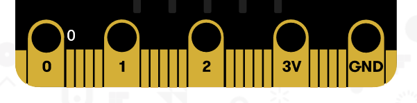

Primeres passes
===============

1.  Obriu la web a <https://makecode.microbit.org>

2.  Connecteu la micro:bit al port USB de l’ordinador amb el seu cable

Blocs bàsics
============

Els dos blocs bàsics de programació de la **micro:bit** son la
“*seqüència d’inici”* el bucle *“per sempre”*. Normalment els trobaràs
quan comencis un programa, però també els pots trobar al menú
*“Básico”*:

{width="5.908333333333333in"
height="6.172916666666667in"}

El bloc d’inici ens serveix per dir-li a la **micro:bit** què ha de fer
la primera vegada que s’encengui. Aquí dibuixem una cara quan s’encén la
micro:bit:

{width="2.4722222222222223in"
height="2.388888888888889in"}

El bloc “per sempre” fa un bucle infinit. És a dir, mentre la micro:bit
estigui encesa executarà tots els blocs que hi hagi a dins. Ara dibuixem
dues cares que es repetiran “per sempre”:

{width="2.361111111111111in"
height="3.7430555555555554in"}

Provar el programa
==================

A l’ordinador
-------------

A l’esquerra teniu un simulador de la micro:bit perquè pugueu provar com
funciona el programa que heu fet:

{width="5.908333333333333in"
height="4.846527777777778in"}

A la micro:bit
--------------

Una vegada ho heu provat, podeu descarregar el programa a la micro:bit
per poder-lo utilitzar amb el botó de descàrrega.

{width="5.354166666666667in"
height="0.9791666666666666in"}

Una vegada descarregat el programa que heu fet, l’haureu de copiar a la
micro:bit, la podreu trobar com un disc del sistema.

Smileys \[Botons\]
==================

Com ja haureu vist, la micro:bit té dos botons, per programar què passa
quan pitgem els botons tenim un bloc al que li podem dir què ha de fer
per cada botó. Es diu “al presionarse el botón”. Podem aprofitar les
cares que hem dissenyat abans:

{width="5.908333333333333in"
height="3.2111111111111112in"}

Extra – bucles
--------------

Per fer més interessant l’acció de pitjar dos botons, afegirem un bucle
(parescut al “para siempre”), però en aquest cas es diu “mientras”:

{width="2.173611111111111in"
height="2.934375546806649in"}

Rotació \[Condicionals\]
========================

La micro:bit té molts de sensors tals com la temperatura, una brúixola i
molts d’altres. En aquest, segons la rotació que de la micro:bit
mostrarem un dibuix o un altre.

El que farem és, primer obtenir el valor de la rotació dins d’una
**variable**. Això ens permetrà utilitzar aquest valor al que li hem
donat un nom dins d’un altre bloc. El bloc condicional necessita d’una
condició que ha de ser veritat o falsa. Segons el que es compleixi a la
condició farà una cosa o una altra. Així que mirarem si la rotació es
major o menor que 0 per dibuixar un gràfic:

{width="5.895833333333333in"
height="5.552083333333333in"}

Descobreix l’equip \[Enviament de missatges\]
=============================================

La micro:bit també té una ràdio per comunicar-se amb les altres
micro:bit que hi hagi a prop. Amb aquest joc haureu de descobrir quin
equip vos envia un missatge. Donau qualque pista als altres perquè
puguin descobrir qui sou.

El primer que farem és dir-li a la micro:bit a quin grup voleu
participar (trieu un nombre del 1 al 3, per exemple):

{width="4.864583333333333in"
height="1.8020833333333333in"}

Després envieu un missatge a la ràdio quan pitgeu el botó A:

{width="5.908333333333333in"
height="1.2743055555555556in"}

I per poder rebre els missatges, teniu al menú de ràdio un bloc per quan
rebeu el missatge. Al menú variables trobareu la variable que necessiteu
mostrar (aquí es diu receivedString):

{width="5.908333333333333in"
height="2.033333333333333in"}

La bolleta \[Operacions matemàtiques\]
======================================

Els ordinadors es varen inventar per resoldre operacions matemàtiques
molt ràpid. En aquest joc utilitzarem les operacions de dividir i sumar
per mostrar un puntet a la pantalla que es mogui segons la inclinació de
la micro:bit.

Emprarem dues **variables** x i y que inicialitzarem al centre de la
pantalla (el cantó d’a dalt a l’esquerra és el 0,0). Després mirarem la
rotació als dos eixos per pintar un puntet, però haurem de dividir el
valor de rotació per reduir la precisió de la rotació i fer el joc més
fàcil:

{width="5.908333333333333in"
height="3.582638888888889in"}

Perquè creus que fa falta invertir el puntet enlloc de només pintar-lo?

Interruptor de contacte \[Pins\]
================================

A més dels botons podem utilitzar els pins de contacte que té la
micro:bit a la part d’a baix

{width="4.013888888888889in"
height="0.9949803149606299in"}

Aquests pins detecten un tancament de circuit entre el 0, 1 ò 2 i la
terra (GND). Si connectem 0 a un tros de paper d’alumini amb un cable
amb cocodril i el GND amb un altre cable i una bolleta d’alumini com als
del dibuix:

{width="4.027777777777778in"
height="2.422442038495188in"}

Amb aquest programa podrem fer un interruptor de contacte:

{width="2.173611111111111in"
height="2.779529746281715in"}

Perquè serveix canviar el valor de *“llum”* cada vegada?

Brúixola \[Condicionals niats\]
===============================

Amb aquest exercici dibuixarem una fletxa cap al nord segons el que ens
indiqui la brúixola de la micro:bit. Per fer aquest exercici primer
obtindrem la direcció de la brúixola i després utilitzarem uns quants
blocs condicionals niats per fer un dibuix o un altre depenent del que
ens indiqui el sensor de la brúixola:

{width="5.908333333333333in"
height="6.254166666666666in"}

Què hauríem de fer per pintar més direccions de la fletxa?

Patata calenta \[Nombres aleatoris\]
====================================

Aquest joc vos indicarà a pantalla a qui li heu de passar la patata
calenta (a dreta o a esquerra) i a qualsevol moment la patata pot
explotar. Per fer el joc, utilitzem una eina matemàtica que ens dona
nombres aleatoris. La configurarem per que ens doni un nombre de 0 a 10
i la ficarem dins d’una variable anomenada “patata”. Després, segons el
valor de la patata mostrarem una imatge o una altra:

{width="4.813540026246719in"
height="6.402777777777778in"}

Per jugar, podeu connectar la micro:bit a les bateries i així vos podreu
passar la patata entre molta gent.

Tria el següent \[Nombres aleatoris\]
=====================================

Aquest joc mostra una fletxa que gira i s’atura a un punt de forma
aleatòria.

{width="5.908333333333333in"
height="3.5618055555555554in"}

Què fa el bloc “cambiar”?

Com fem que la xifra “direcció” no es faci més gran que 4?
